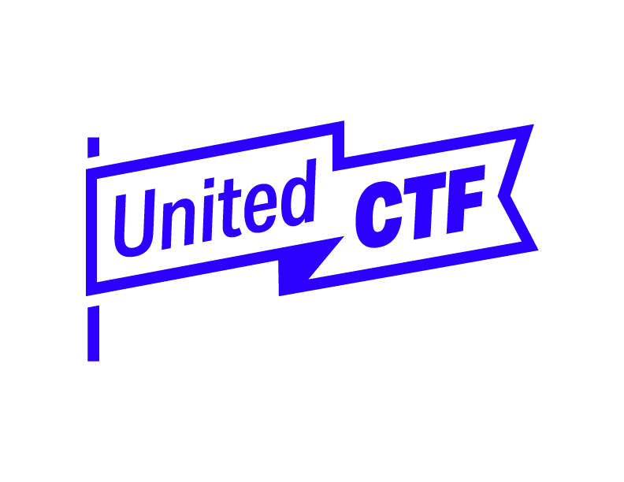

# UnitedCTF 2022

## About
This repository contains CTF challenges and official write-ups for UnitedCTF 2022.

## Contribution Guidelines

Consider reading our [Contribution Guidelines](./.github/CONTRIBUTING.md) before making a contribution.

Make sure to stick to the following flag format in all your challenges (when possible): `FLAG-.+`.  
Ideally, the flag should be impossible to guess or to brute force.

The directory structure of a challenge should look similar to [this one](./.github/challenge-example/).

## License

Distributed under the GNU Affero General Public License version 3. See [`LICENSE`](./LICENSE) for more information.